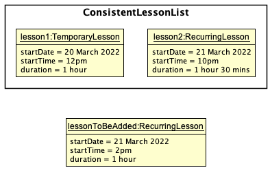
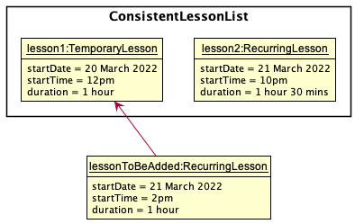
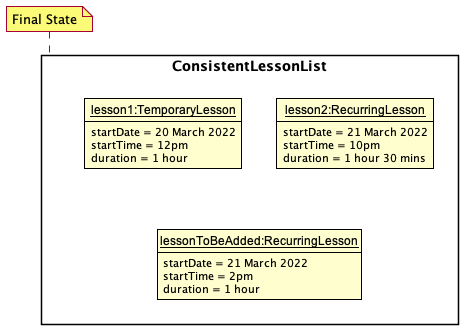

* Table of Contents
  {:toc}

--------------------------------------------------------------------------------------------------------------------

## **Acknowledgements**
TODO

* {list here sources of all reused/adapted ideas, code, documentation, and third-party libraries -- include links to the original source as well}

--------------------------------------------------------------------------------------------------------------------

## **Setting up, getting started**

TODO

--------------------------------------------------------------------------------------------------------------------

## **Design**

TODO

### Architecture

TODO

### UI component

TODO

### Logic component

TODO

### Model component
**API** : [`Model.java`](https://github.com/AY2122S2-CS2103T-W11-3/tp/blob/master/src/main/java/seedu/address/model/Model.java)

The `ModelManager` component,
* stores the student book data i.e., all `Student` objects (which are contained in a `UniquePersonList` object).
* stores the lesson book data i.e., all `Lesson` objects (which are contained in a `ConsistentLessonList` object).
* stores a `UserPref` object that represents the user’s preferences.

the `ModelManager` component also,
* stores the currently 'selected' `Student` objects (e.g., results of a search query) as a separate _filtered_ list which is exposed to outsiders as an unmodifiable `ObservableList<Student>` that can be 'observed' e.g. the UI can be bound to this list so that the UI automatically updates when the data in the list change.
* similarly, it stores the currently 'selected' `Lesson` objects (e.g., results of a search query) as a separate _filtered_ list which is exposed to outsiders as an unmodifiable `ObservableList<Lesson>` that can be 'observed' e.g. the UI can be bound to this list so that the UI automatically updates when the data in the list change.

Each `Lesson` has an association with a list of `EnrolledStudents`, which contains references to each `Student` assigned to the lesson.

### Storage component

TODO

### Common classes

TODO

--------------------------------------------------------------------------------------------------------------------

## **Implementation**

This section describes some noteworthy details on how certain features are implemented.

### Add temporary/recurring lesson
Adding a lesson is enabled by the `ConsistentLessonList` class, which ensures that no lessons in record clash with one another.

This is achieved by enforcing ***consistency*** between existing lessons stored in the application.

A lesson list is considered ***consistent*** when no lessons in the list clash with one another. In particular, the following two conditions are enforced by the `ConsistentLessonList`:
- no two temporary lessons should have overlapping timeslots (ie: a lesson should start when another lesson has not ended)
- no recurring lesson should have overlapping timeslots with any temporary lesson or recurring lesson that falls on the same weekday as it

This is done with the method `ConsistentLessonList#hasConflictingLesson()`, which takes in a `Lesson` that is to be added to the list and returns true if any existing lessons clashes with it.

Given below is an example scenario:

Step 1. The user requests to add a lesson that,
- is on 20 March 2022
- starts at 12 pm
- lasts for 1 hour

Step 2. The method `ConsistentLessonList#add()` is called, with the new lesson passed in as the argument. The method `ConsistentLessonList#hasConflictingLesson()` is then called, which checks if the first existing lesson clashes with this one using the method `Lesson#isConflictingWithLesson()`.

Step 3. The method then moves down the list and checks if the second existing lesson clashes with this one using the method `Lesson#isConflictingWithLesson()`.

After all the existing lessons have been verified to not clash with the new lesson, it is added to the list of lessons.

--------------------------------------------------------------------------------------------------------------------

## **Documentation, logging, testing, configuration, dev-ops**

* [Documentation guide](Documentation.md)
* [Testing guide](Testing.md)
* [Logging guide](Logging.md)
* [Configuration guide](Configuration.md)
* [DevOps guide](DevOps.md)

--------------------------------------------------------------------------------------------------------------------

## **Appendix: Requirements**

### Product scope

**Target user profile**:
- is a private tutor
- has multiple students and classes
- can type fast
- skilled at using the command line

**Value proposition**:\
If a tutor has many students, it may be difficult to keep track of all of the students and the rates offered to each of them. TeachWhat! solves this issue by helping tutors manage their schedule, students and income more efficiently.

### User stories
Priorities: High (must have) - `* * *`, Medium (nice to have) - `* *`, Low (unlikely to have) - `*`

| Priority | As a …​    | I want to …​                                             | So that I can…​                                              |
|---------|------------|----------------------------------------------------------|--------------------------------------------------------------|
| `* * *` | user       | add my student's information                             | keep track of their progress                                 |
| `* * *` | user       | delete classes                                           | clear old classes                                            |
| `* * *` | user       | delete students and their details                        | reduce clutter of old students and keep their privacy intact |
| `* * *` | user       | add classes to the list and assign students to the class | have an overview of which students are attending the class   |
| `* *`   | a new user | clear and reset my entire list of classes and students   | add actual data after testing the program out                |
| `* *`   | user       | specify the type of class when creating one              | know if a class is permanent or a temporary class            |

### Use cases

#### Add a temporary lesson
**System:** TeachWhat!  
**Use case:** UC1 - Add a temporary lesson  
**Actor:** User

**MSS**
1. User adds a temporary lesson with a specified name, subject, address, date, time and duration.
2. TeachWhat! updates the list of lesson.
   Use case ends.

**Extensions**
* 1a. User did not provide any name.
    * 1a1. TeachWhat! shows an error message.  
      Use case resumes at step 1.

* 1b. User did not provide a date or date has invalid format.
    * 1b1. TeachWhat! shows an error message.  
      Use case resumes at step 1.

* 1c. User did not provide a starting time or starting time has invalid format.
    * 1c1. TeachWhat! shows an error message.  
      Use case resumes at step 1.

* 1d. User did not provide the duration of class or duration of class has invalid format.
    * 1d1. TeachWhat! shows an error message.  
      Use case resumes at step 1.

* 1e. User already has an existing class overlapping with the specified starting, ending time and date.
    * 1e1. TeachWhat! shows an error message.  
      Use case resumes at step 1.

#### Add a recurring lesson
**System:** TeachWhat!  
**Use case:** UC2 - Add a recurring lesson  
**Actor:** User

**MSS**
1. User adds a recurring lesson with a specified name, subject, address, date, time and duration.
2. TeachWhat! updates the list of lesson.
   Use case ends.

**Extensions**
* 1a. User did not provide any name.
    * 1a1. TeachWhat! shows an error message.  
      Use case resumes at step 1.

* 1b. User did not provide a date or date has invalid format.
    * 1b1. TeachWhat! shows an error message.  
      Use case resumes at step 1.

* 1c. User did not provide a starting time or starting time has invalid format.
    * 1c1. TeachWhat! shows an error message.  
      Use case resumes at step 1.

* 1d. User did not provide the duration of class or duration of class has invalid format.
    * 1d1. TeachWhat! shows an error message.  
      Use case resumes at step 1.

* 1e. User already has an existing class overlapping with the specified starting, ending time and date.
    * 1e1. TeachWhat! shows an error message.  
      Use case resumes at step 1.

#### Delete a lesson

**System:** TeachWhat!  
**Use case:** UC3 - Delete a lesson   
**Actor:** User

**MSS**
1. User requests to list lessons
2. TeachWhat! shows a list of lessons
3. User requests to delete a specific lesson in the list
4. TeachWhat! deletes the lesson  
   Use case ends.

**Extensions**
* 2a. The list is empty.  
  Use case ends.

* 3a. The given index is invalid.
    * 3a1. TeachWhat! shows an error message.  
      Use case resumes at step 2.

* 3b. The specified lesson still has students assigned to it.
    * 3b1. TeachWhat! shows a warning message.
    * 3b2a. User confirms deletion.  
      Use case ends.
    * 3b2b. User cancels deletion.  
      Use case ends.

#### Assign a student to a class

**System:** TeachWhat!  
**Use case:** UC4 - Assign a student to a class  
**Actor:** User

**MSS**
1. User requests to list students
2. TeachWhat! shows a list of students
3. User selects the student
4. User requests to list classes
5. TeachWhat! shows a list of classes
6. User selects the class to assign the student to  
   Use case ends.

**Extensions**
* 2a. The list is empty.  
  Use case ends.

* 3a. The given index is invalid.
    * 3a1. StudentBook shows an error message.  
      Use case resumes at step 2.

* 5a. The list is empty.
    * 4a1. ClassBook shows a warning message.  
      Use case ends.

* 6a. The given index is invalid.
    * 6a1. ClassBook shows an error message.  
      Use case resumes at step 5.

#### Delete a student

**System:** TeachWhat!  
**Use case:** UC5 - Delete a student  
**Actor:** User

**MSS**
1. User requests to list students
2. TeachWhat! shows a list of students
3. User requests to delete a specific student in the list
4. TeachWhat! deletes the student  
   Use case ends.

**Extensions**
* 2a. The list is empty.  
  Use case ends.

* 3a. The given index is invalid.
    * 3a1. TeachWhat! shows an error message.  
      Use case resumes at step 2.

### Non-Functional Requirements

1. TeachWhat! able to run on all mainstream OS that has Java 11 or above installed
2. Should be able to hold up to 1000 students and classes without a noticeable sluggishness in performance for typical
   usage
3. A user with above average typing speed for regular English text (i.e. not code, not system admin commands) should be
   able to accomplish most of the tasks faster using commands than using the mouse
4. A new user should be able to pick up on how to use TeachWhat! within 10 minutes
5. TeachWhat! must boot up within 5 seconds on a device that is under normal load (i.e. not running cpu intensive applications in the background).

### Glossary

* **Mainstream OS**: Windows, Linux, Unix, OS-X
* **Command Line**: A text interface for your computer.

--------------------------------------------------------------------------------------------------------------------

## **Appendix: Instructions for manual testing**

Given below are instructions to test the app manually.

:information_source: **Note:** These instructions only provide a starting point for testers to work on;
testers are expected to do more *exploratory* testing.

### Launch and shutdown

TODO

### Deleting a student

TODO

### Saving data

TODO
