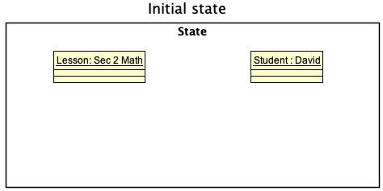
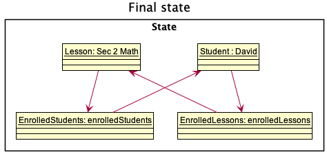
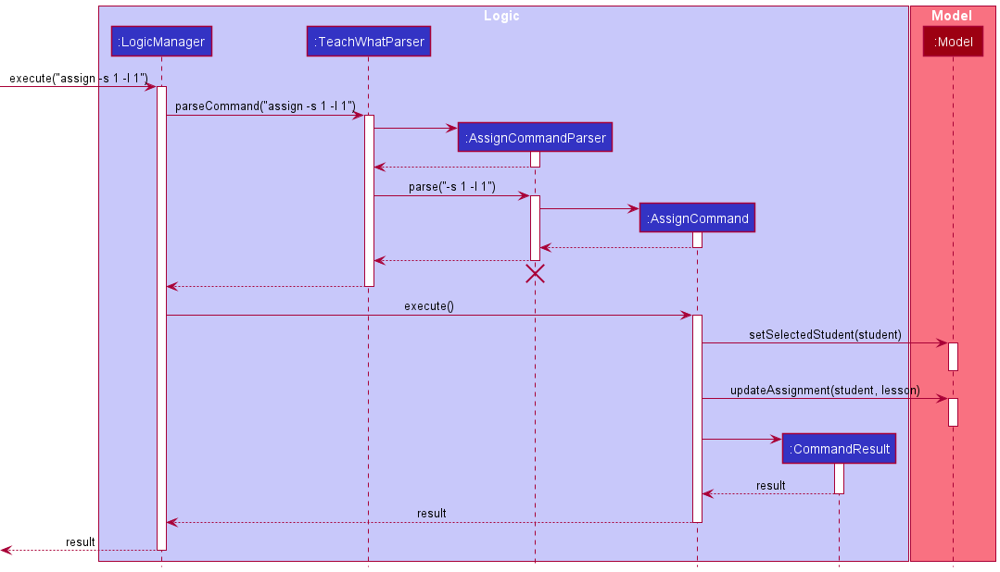

* Table of Contents
  {:toc}

--------------------------------------------------------------------------------------------------------------------

## **Acknowledgements**
TODO

* {list here sources of all reused/adapted ideas, code, documentation, and third-party libraries -- include links to the original source as well}

--------------------------------------------------------------------------------------------------------------------

## **Setting up, getting started**

TODO

--------------------------------------------------------------------------------------------------------------------

## **Design**

TODO

### Architecture

TODO

### UI component

TODO

### Logic component

TODO

### Model component

TODO

### Storage component

TODO

### Common classes

TODO

--------------------------------------------------------------------------------------------------------------------

## **Implementation**

This section describes some noteworthy details on how certain features are implemented.

TODO

### Assign student to lesson

The feature assigns a `Student` to a `Lesson`. The `AssignCommand` class 
extends the `Command` and overwrites the `Command#execute()` method.

Using the `Model` object passed in as an argument of the `AssignCommand#execute()`
method, the following methods are invoked in the `AssignCommand#execute()` method:
* `Model#updateAssignment()`
    * adds `Student` to the `enrolledStudents` attribute `Lesson`
    * adds `Lesson` to the `enrolledLessons` attribute of the `Student`
* `Model#setSelectedStudent()` - sets the `selectedStudent` attribute of `Model` to
the `Student` that is being assigned. This is done to display the `Student` details
in the `MainWindow#InfoPanel`.

The `AssignCommand#execute()` method returns a `CommandResult` upon a
successful assignment.

Given below is an example usage scenario on how the assign command works.

####Step 1: The user launches the application and executes the following
* `addlesson -n Sec 2 Math...` which adds a `Lesson` named "Sec 2 Math".
* `addstudent -n David...` which adds a `Student` named "David".

#### Step 2: The user executes the following to find the respective IDs of the `Student` and `Lesson`.
* `listlessons` command to see that the `Lesson` named "Sec 2 Math" has a `LESSON_ID` of 1.
* `liststudents` command to see that the `Student` named "David" has a `STUDENT_ID` of 1.

#### Step 3: The user executes the command `assign -s 1 -l 1`. The command does the following:
* adds `Student` "David" to the `enrolledStudents` attribute of the `Lesson` "Sec 2 Math".
* adds `Lesson` "Sec 2 Math" to the `enrolledLessons` attribute of the `Student` "David".

The following sequence diagram shows how the assign operation works.

> **Note**: The lifeline for AssignCommandParser should end at the destroy marker (X) but due to a limitation of 
> PlantUML, the lifeline reaches the end of diagram.

--------------------------------------------------------------------------------------------------------------------

## **Documentation, logging, testing, configuration, dev-ops**

* [Documentation guide](Documentation.md)
* [Testing guide](Testing.md)
* [Logging guide](Logging.md)
* [Configuration guide](Configuration.md)
* [DevOps guide](DevOps.md)

--------------------------------------------------------------------------------------------------------------------

## **Appendix: Requirements**

### Product scope

**Target user profile**:
- is a private tutor
- has multiple students and classes
- can type fast
- skilled at using the command line

**Value proposition**:\
If a tutor has many students, it may be difficult to keep track of all of the students and the rates offered to each of them. TeachWhat! solves this issue by helping tutors manage their schedule, students and income more efficiently.

### User stories
Priorities: High (must have) - `* * *`, Medium (nice to have) - `* *`, Low (unlikely to have) - `*`

| Priority | As a …​    | I want to …​                                             | So that I can…​                                              |
|---------|------------|----------------------------------------------------------|--------------------------------------------------------------|
| `* * *` | user       | add my student's information                             | keep track of their progress                                 |
| `* * *` | user       | delete classes                                           | clear old classes                                            |
| `* * *` | user       | delete students and their details                        | reduce clutter of old students and keep their privacy intact |
| `* * *` | user       | add classes to the list and assign students to the class | have an overview of which students are attending the class   |
| `* *`   | a new user | clear and reset my entire list of classes and students   | add actual data after testing the program out                |
| `* *`   | user       | specify the type of class when creating one              | know if a class is permanent or a temporary class            |

### Use cases

#### Add a temporary lesson
**System:** TeachWhat!  
**Use case:** UC1 - Add a temporary lesson  
**Actor:** User

**MSS**
1. User adds a temporary lesson with a specified name, subject, address, date, time and duration.
2. TeachWhat! updates the list of lesson.
   Use case ends.

**Extensions**
* 1a. User did not provide any name.
    * 1a1. TeachWhat! shows an error message.  
      Use case resumes at step 1.

* 1b. User did not provide a date or date has invalid format.
    * 1b1. TeachWhat! shows an error message.  
      Use case resumes at step 1.

* 1c. User did not provide a starting time or starting time has invalid format.
    * 1c1. TeachWhat! shows an error message.  
      Use case resumes at step 1.

* 1d. User did not provide the duration of class or duration of class has invalid format.
    * 1d1. TeachWhat! shows an error message.  
      Use case resumes at step 1.

* 1e. User already has an existing class overlapping with the specified starting, ending time and date.
    * 1e1. TeachWhat! shows an error message.  
      Use case resumes at step 1.

#### Add a recurring lesson
**System:** TeachWhat!  
**Use case:** UC2 - Add a recurring lesson  
**Actor:** User

**MSS**
1. User adds a recurring lesson with a specified name, subject, address, date, time and duration.
2. TeachWhat! updates the list of lesson.
   Use case ends.

**Extensions**
* 1a. User did not provide any name.
    * 1a1. TeachWhat! shows an error message.  
      Use case resumes at step 1.

* 1b. User did not provide a date or date has invalid format.
    * 1b1. TeachWhat! shows an error message.  
      Use case resumes at step 1.

* 1c. User did not provide a starting time or starting time has invalid format.
    * 1c1. TeachWhat! shows an error message.  
      Use case resumes at step 1.

* 1d. User did not provide the duration of class or duration of class has invalid format.
    * 1d1. TeachWhat! shows an error message.  
      Use case resumes at step 1.

* 1e. User already has an existing class overlapping with the specified starting, ending time and date.
    * 1e1. TeachWhat! shows an error message.  
      Use case resumes at step 1.

#### Delete a lesson

**System:** TeachWhat!  
**Use case:** UC3 - Delete a lesson   
**Actor:** User

**MSS**
1. User requests to list lessons
2. TeachWhat! shows a list of lessons
3. User requests to delete a specific lesson in the list
4. TeachWhat! deletes the lesson  
   Use case ends.

**Extensions**
* 2a. The list is empty.  
  Use case ends.

* 3a. The given index is invalid.
    * 3a1. TeachWhat! shows an error message.  
      Use case resumes at step 2.

* 3b. The specified lesson still has students assigned to it.
    * 3b1. TeachWhat! shows a warning message.
    * 3b2a. User confirms deletion.  
      Use case ends.
    * 3b2b. User cancels deletion.  
      Use case ends.

#### Assign a student to a class

**System:** TeachWhat!  
**Use case:** UC4 - Assign a student to a class  
**Actor:** User

**MSS**
1. User requests to list students
2. TeachWhat! shows a list of students
3. User selects the student
4. User requests to list classes
5. TeachWhat! shows a list of classes
6. User selects the class to assign the student to  
   Use case ends.

**Extensions**
* 2a. The list is empty.  
  Use case ends.

* 3a. The given index is invalid.
    * 3a1. StudentBook shows an error message.  
      Use case resumes at step 2.

* 5a. The list is empty.
    * 4a1. ClassBook shows a warning message.  
      Use case ends.

* 6a. The given index is invalid.
    * 6a1. ClassBook shows an error message.  
      Use case resumes at step 5.

#### Delete a student

**System:** TeachWhat!  
**Use case:** UC5 - Delete a student  
**Actor:** User

**MSS**
1. User requests to list students
2. TeachWhat! shows a list of students
3. User requests to delete a specific student in the list
4. TeachWhat! deletes the student  
   Use case ends.

**Extensions**
* 2a. The list is empty.  
  Use case ends.

* 3a. The given index is invalid.
    * 3a1. TeachWhat! shows an error message.  
      Use case resumes at step 2.

### Non-Functional Requirements

1. TeachWhat! able to run on all mainstream OS that has Java 11 or above installed
2. Should be able to hold up to 1000 students and classes without a noticeable sluggishness in performance for typical
   usage
3. A user with above average typing speed for regular English text (i.e. not code, not system admin commands) should be
   able to accomplish most of the tasks faster using commands than using the mouse
4. A new user should be able to pick up on how to use TeachWhat! within 10 minutes
5. TeachWhat! must boot up within 5 seconds on a device that is under normal load (i.e. not running cpu intensive applications in the background).

### Glossary

* **Mainstream OS**: Windows, Linux, Unix, OS-X
* **Command Line**: A text interface for your computer.

--------------------------------------------------------------------------------------------------------------------

## **Appendix: Instructions for manual testing**

Given below are instructions to test the app manually.

:information_source: **Note:** These instructions only provide a starting point for testers to work on;
testers are expected to do more *exploratory* testing.

### Launch and shutdown

TODO

### Deleting a student

TODO

### Saving data

TODO
