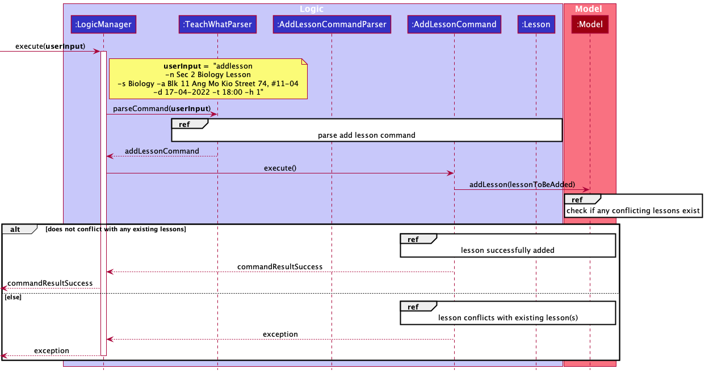
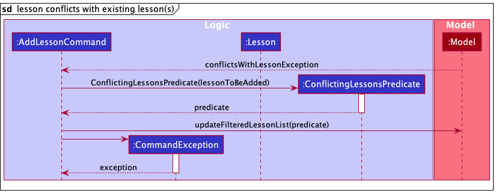
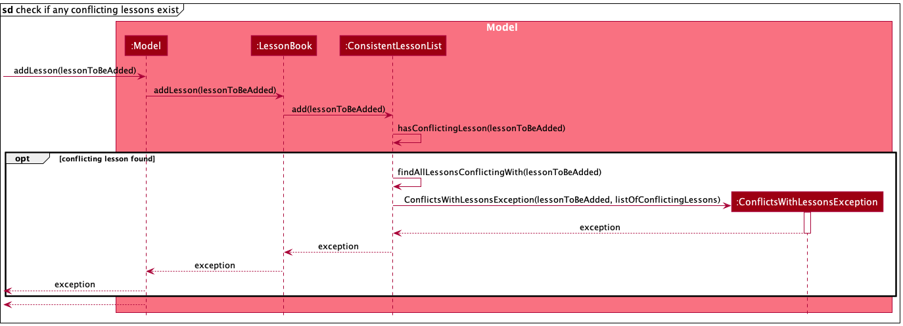
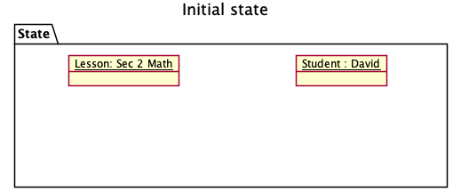

* Table of Contents
  {:toc}

--------------------------------------------------------------------------------------------------------------------

## **Acknowledgements**
TODO

* {list here sources of all reused/adapted ideas, code, documentation, and third-party libraries -- include links to the original source as well}

--------------------------------------------------------------------------------------------------------------------

## **Setting up, getting started**

TODO

--------------------------------------------------------------------------------------------------------------------

## **Design**

TODO

### Architecture

TODO

### UI component
The **API** of this component is specified in `Ui.java`

The UI consists of a `MainWindow` that is made up of multiple parts eg. `CommandBox`, `ResultDisplay`, 
`StudentListPanel`, `InfoPanel` etc. All these components, including the `MainWindow` inherits from the abstract
`UiPart` class which captures the commonalities between classes that represent parts of the visible GUI.

The `UI` component uses the JavaFx UI framework. The layout of these UI parts are defined in matching `.fxml` files 
that are in the `src/main/resources/view` folder. For example, the layout of the 
[`MainWindow`](https://github.com/AY2122S2-CS2103T-W11-3/tp/blob/master/src/main/java/seedu/address/ui/MainWindow.java) is specified in 
[`MainWindow.fxml`](../src/main/resources/view/MainWindow.fxml).

The `UI` component,
- executes user commands using the `Logic` component.
- listens for changes to `Model` data so that the UI can be updated with the modified data.
- keeps a reference to the `Logic` component, because the `UI` relies on the `Logic` component to execute commands.
- depends on some classes in the `Model` component, as it displays `Person` object residing in the `Model`.

The bottom half of the `UI` component is split into two parts using a `SplitPane` component from 
the JavaFX UI framework. 

The left pane contains a `TabPane` that contains two tabs which hold a 
[`LessonListPanel`](https://github.com/AY2122S2-CS2103T-W11-3/tp/blob/master/src/main/java/seedu/address/ui/listpanel/LessonListPanel.java) and a
[`StudentListPanel`](https://github.com/AY2122S2-CS2103T-W11-3/tp/blob/master/src/main/java/seedu/address/ui/listpanel/StudentListPanel.java).
The **_Lessons_** tab contains a 
[`LessonListPanel`](https://github.com/AY2122S2-CS2103T-W11-3/tp/blob/master/src/main/java/seedu/address/ui/listpanel/LessonListPanel.java) which lists out `Lesson` entries 
while the **_Students_** tab contains a 
[`StudentListPanel`](https://github.com/AY2122S2-CS2103T-W11-3/tp/blob/master/src/main/java/seedu/address/ui/listpanel/StudentListPanel.java) which lists out `Student`
entries.

To switch between the tabs, the methods `MainWindow#toggleLessonTab()` and `MainWindow#toggleStudentTab()` can be used 
to switch between the **_Lesson_** tab and **_Student_** tab respectively. Switching the tabs by using user commands is 
done by the method `MainWindow#toggleTab()`.

The right pane contains an [`InfoPanel`](https://github.com/AY2122S2-CS2103T-W11-3/tp/blob/master/src/main/java/seedu/address/ui/infopanel/InfoPanel.java) 
component can either show the details of a `Lesson` entry or `Student` entry. A
[`LessonInfoPanel`](https://github.com/AY2122S2-CS2103T-W11-3/tp/blob/master/src/main/java/seedu/address/ui/infopanel/LessonInfoPanel.java) is used to show the details of a 
`Lesson` entry, while a [`StudentInfoPanel`](https://github.com/AY2122S2-CS2103T-W11-3/tp/blob/master/src/main/java/seedu/address/ui/infopanel/StudentInfoPanel.java) is used
to show the details of a `Student` entry.

The methods `MainWindow#populateInfoPanelWithLesson()` and `MainWindow#populateInfoPanelWithStudent()` can be used to
populate the `InfoPanel` with the provided entry. Populating the `InfoPanel` using user commands is handled by the 
method `MainWindow#handleInfoPanelUpdate()`.

### Logic component

TODO

### Model component
**API** : [`Model.java`](https://github.com/AY2122S2-CS2103T-W11-3/tp/blob/master/src/main/java/seedu/address/model/Model.java)

The `ModelManager` component,
* stores the student book data i.e., all `Student` objects (which are contained in a `UniquePersonList` object).
* stores the lesson book data i.e., all `Lesson` objects (which are contained in a `ConsistentLessonList` object).
* stores a `UserPref` object that represents the user’s preferences.

the `ModelManager` component also,
* stores the currently 'selected' `Student` objects (e.g., results of a search query) as a separate _filtered_ list which is exposed to outsiders as an unmodifiable `ObservableList<Student>` that can be 'observed' e.g. the UI can be bound to this list so that the UI automatically updates when the data in the list change.
* similarly, it stores the currently 'selected' `Lesson` objects (e.g., results of a search query) as a separate _filtered_ list which is exposed to outsiders as an unmodifiable `ObservableList<Lesson>` that can be 'observed' e.g. the UI can be bound to this list so that the UI automatically updates when the data in the list change.

Each `Lesson` has an association with a list of `EnrolledStudents`, which contains references to each `Student` assigned to the lesson.

### Storage component

TODO

### Common classes

TODO

--------------------------------------------------------------------------------------------------------------------

## **Implementation**

This section describes some noteworthy details on how certain features are implemented.

### Viewing a Lesson or Student's details

Viewing details of a `Lesson` or `Student` on the `InfoPanel` component in the `UI` is done through the `lesson` or 
`student` command.

When the command is entered, the 
[`TeachWhatParser`](https://github.com/AY2122S2-CS2103T-W11-3/tp/blob/master/src/main/java/seedu/address/logic/parser/TeachWhatParser.java)
would **parse** the given user input and return either a 
[`ViewLessonInfoCommand`](https://github.com/AY2122S2-CS2103T-W11-3/tp/blob/master/src/main/java/seedu/address/logic/commands/ViewLessonInfoCommand.java)
or [`ViewStudentInfoCommand`](https://github.com/AY2122S2-CS2103T-W11-3/tp/blob/master/src/main/java/seedu/address/logic/commands/ViewStudentInfoCommand.java) 
object, depending on which command was used. 

When the Command is executed by `Logic`, the executed command would make some attribute changes to `Model` (which holds
the data of the App in memory) and also update the `InfoPanel` component of the `UI` with detailed information of the 
selected `Lesson` or `Student`. A more detailed explanation is shown below.

Given below is an example where a user inputs `student 1` as a command to view the details of the first student on the 
list.

Step 1: User inputs `student 1` into the `CommandBox` and hits enter.

[`MainWindow`](https://github.com/AY2122S2-CS2103T-W11-3/tp/blob/master/src/main/java/seedu/address/ui/MainWindow.java)
receives the user input through the `MainWindow#executeCommand()` method. 
[`MainWindow`](https://github.com/AY2122S2-CS2103T-W11-3/tp/blob/master/src/main/java/seedu/address/ui/MainWindow.java)
then sends the user input to `Logic` and retrieves the result.

Step 2: `Logic` parses the user's input and returns the result

`Logic` parses the user's input through multiple `Parser` classes as shown in the sequence diagram above. User
input is first sent to the [`TeachWhatParser`](https://github.com/AY2122S2-CS2103T-W11-3/tp/blob/master/src/main/java/seedu/address/logic/parser/TeachWhatParser.java)
where it looks for the main command `student`. It passes the arguments to
the relevant **Command Parser** which in this case is 
[`ViewStudentInfoParser`](https://github.com/AY2122S2-CS2103T-W11-3/tp/blob/master/src/main/java/seedu/address/logic/parser/ViewStudentInfoCommandParser.java).

[`ViewStudentInfoParser`](https://github.com/AY2122S2-CS2103T-W11-3/tp/blob/master/src/main/java/seedu/address/logic/parser/ViewStudentInfoCommandParser.java)
takes in the provided index and creates a 
[`ViewStudentInfoCommand`](https://github.com/AY2122S2-CS2103T-W11-3/tp/blob/master/src/main/java/seedu/address/logic/commands/ViewStudentInfoCommand.java).
This `Command` is returned back to `LogicManager` where it is executed with the `ViewStudentInfoCommand#execute()` method.

Step 3: Executing the command

As shown in the diagram above, when `ViewStudentInfoCommand#execute()` is called,
[`ViewStudentInfoCommand`](https://github.com/AY2122S2-CS2103T-W11-3/tp/blob/master/src/main/java/seedu/address/logic/commands/ViewStudentInfoCommand.java)
retrieves the filtered list (the current list shown in the UI) from `Model` and picks out the selected student based on
the index provided by the user's input. It then sets `ModelManager#selectedStudent` using the 
`ModelManager#setSelectedStudent()` method, which will be used by
[`MainWindow`](https://github.com/AY2122S2-CS2103T-W11-3/tp/blob/master/src/main/java/seedu/address/ui/MainWindow.java)
later on.

[`ViewStudentInfoCommand`](https://github.com/AY2122S2-CS2103T-W11-3/tp/blob/master/src/main/java/seedu/address/logic/commands/ViewStudentInfoCommand.java)
creates a 
[`CommandResult`](https://github.com/AY2122S2-CS2103T-W11-3/tp/blob/master/src/main/java/seedu/address/logic/commands/CommandResult.java)
object, with the parameter `infoPanelType = InfoPanelTypes.STUDENT`. 
[`InfoPanelTypes`](https://github.com/AY2122S2-CS2103T-W11-3/tp/blob/master/src/main/java/seedu/address/logic/commands/misc/InfoPanelTypes.java)
is an enumerator representing the different states of the InfoPanel. This is then returned to `LogicManager` which
returns it back to `MainWindow`.

Step 4: Updating the UI

Once 
[`MainWindow`](https://github.com/AY2122S2-CS2103T-W11-3/tp/blob/master/src/main/java/seedu/address/ui/MainWindow.java) 
receives the 
[`CommandResult`](https://github.com/AY2122S2-CS2103T-W11-3/tp/blob/master/src/main/java/seedu/address/logic/commands/CommandResult.java)
object, it checks for the `CommandResult#updateInfoPanel` boolean. If the
boolean is true, it runs the `MainWindow#handleInfoPanelUpdate()` method which updates the `InfoPanel`. It does this by
retrieving the selected student from `ModelManager#selectedStudent` and creates a new
[`StudentInfoPanel`](https://github.com/AY2122S2-CS2103T-W11-3/tp/blob/master/src/main/java/seedu/address/ui/infopanel/StudentInfoPanel.java)
with the selected student and its details. The newly created
[`StudentInfoPanel`](https://github.com/AY2122S2-CS2103T-W11-3/tp/blob/master/src/main/java/seedu/address/ui/infopanel/StudentInfoPanel.java)
is shown on the right side of the application.

The execution of the command is complete and the result is shown in the image below, where the right side of the
application is updated with the details of the selected `Student`.

A similar process is done when using the `lesson` command but with its corresponding `Parser` and `Command` objects.

### Add student
Adding a new `Student` to TeachWhat! is done through the `LogicManager`. The user input is parsed by the 
`TeachWhatParser` into a `Command` which is executed by `LogicManager#execute()`.

Given below is an example scenario:

Step 1. The user requests to add a student that has the following details,
- `name`: Samuel
- `phone number`: 64874982
- `email`: simp4raiden@gmail.com
- `address`: 6 Raffles Quay Singapore, 048580 Singapore
- `tag`: struggling in math, good in cs

Step 2. The user enters the command

``addstudent -n Samuel -p 64874982 -e simp4raiden@gmail.com -a 6 Raffles Quay Singapore, 048580 Singapore -t struggling in math -t good in cs``

Step 3. The user input is passed into `LogicManager#execute(commandText)`.

Step 4. `LogicManager` uses the `TeachWhatParser#parseCommand(userInput)` to parse the user input.

Step 5. The `TeachWhatParser` detects the command word `addstudent` and passes the student details to `AddStudentCommandParser#parse(args)`.

Step 6. The `AddStudentCommandParser` uses `ArgumentMultimap` to map the student details into the prefixes `name`, `phone`, `email`, `address` and `tag`, and constructs a new `Student` and passes the `Student` to
`AddStudentCommand` which it then returns.

* Constraints
    * Multiple `tag` prefixes can be given but only one `name`, `phone`, `email` and `address` can be given.
    * All the prefixes are optional except for `name` and `phone`

      `ParseException` will be thrown if the constraints are violated

Step 7. The `LogicManager` then executes the `AddStudentCommand` and the `Student` is added to the `Student Book` if another `Student` with the same name does not already exist.

The following sequence diagram shows how the add student command works.

### Add temporary/recurring lesson
Adding a new `Lesson` to TeachWhat! follows a process that is similar to adding a new `Student`, with the following key differences,
- the `TeachWhatParser` detects the command word `addlesson` and passes the lessons details to `AddLessonCommandParser#parse`
- the `AddLessonCommandParser` then maps the arguments into the prefixes `name`, `subject`, `address`, `date`, `startTime` and `recurring`
- after which it constructs a new `Lesson` and passes it to the `AddLessonComand` 

The following sequence diagram shows how the add lesson operation works when a user enters the following command:
`addlesson
-n Sec 2 Biology Lesson
-s Biology -a Blk 11 Ang Mo Kio Street 74, #11-04
-d 17-04-2022 -t 18:00 -h 1`

The following sequence diagram shows,
- how an `AddLessonCommand` is instantiated from the given user input
- how a new instance of a `TemporaryLesson` or `RecurringLesson` is instantiated from the arguments given by the user

The following sequence diagram shows how `AddLessonCommand`
- sets the newly added lesson as the selected lesson in the UI through `Model`

The following sequence diagram shows how `AddLessonCommand`
- updates the UI to show a list of conflicting lessons by updating the filtered lesson list through `Model` using an instance of `ConflictingLessonsPredicate`

#### Determining if a lesson clashes with any existing lessons

When a user requests to add a new lesson to the list, it is important to check that the new lesson ***does not clash with any existing lessons in the list.***

This is done by the `ConsistentLessonList` class, which enforces ***consistency*** between existing lessons stored in the list.

A list of lessons is considered ***consistent*** when no lessons clash with each another. In particular, the following two conditions are enforced by the `ConsistentLessonList`:
- no two temporary lessons should have overlapping timeslots (ie: a lesson should ***not*** start when another lesson has not ended)
- no recurring lesson should have overlapping timeslots with any temporary lesson or recurring lesson that falls on the same weekday as it

This is done with the method `ConsistentLessonList#hasConflictingLesson()`, which takes in the `Lesson` to be added and
- goes through the list and compares each *existing* `Lesson` with it
- and returns true if any existing lessons clashes with it

The following sequence diagram shows how this is done:

### Assign student to lesson

The feature assigns a `Student` to a `Lesson`. The `AssignCommand` class 
extends the `Command` and overwrites the `Command#execute()` method.

Using the `Model` object passed in as an argument of the `AssignCommand#execute()`
method, the following methods are invoked in the `AssignCommand#execute()` method:
* `Model#updateAssignment()`
    * adds `Student` to the `enrolledStudents` attribute `Lesson`
    * adds `Lesson` to the `enrolledLessons` attribute of the `Student`
* `Model#setSelectedStudent()` - sets the `selectedStudent` attribute of `Model` to
the `Student` that is being assigned. This is done to display the `Student` details
in the `MainWindow#InfoPanel`.

The `AssignCommand#execute()` method returns a `CommandResult` upon a
successful assignment.

Given below is an example usage scenario on how the assign command works.

#### Step 1: The user launches the application and executes the following
* `addlesson -n Sec 2 Math...` which adds a `Lesson` named "Sec 2 Math".
* `addstudent -n David...` which adds a `Student` named "David".

#### Step 2: The user executes the following to find the respective IDs of the `Student` and `Lesson`.
* `listlessons` command to see that the `Lesson` named "Sec 2 Math" has a `LESSON_ID` of 1.
* `liststudents` command to see that the `Student` named "David" has a `STUDENT_ID` of 1.

#### Step 3: The user executes the command `assign -s 1 -l 1`. The command does the following:
* adds `Student` "David" to the `enrolledStudents` attribute of the `Lesson` "Sec 2 Math".
* adds `Lesson` "Sec 2 Math" to the `enrolledLessons` attribute of the `Student` "David".

The following sequence diagram shows how the assign operation works.

> **Note**: The lifeline for AssignCommandParser should end at the destroy marker (X) but due to a limitation of 
> PlantUML, the lifeline reaches the end of diagram.

--------------------------------------------------------------------------------------------------------------------

## **Documentation, logging, testing, configuration, dev-ops**

* [Documentation guide](Documentation.md)
* [Testing guide](Testing.md)
* [Logging guide](Logging.md)
* [Configuration guide](Configuration.md)
* [DevOps guide](DevOps.md)

--------------------------------------------------------------------------------------------------------------------

## **Appendix: Requirements**

### Product scope

**Target user profile**:
- is a private tutor
- has multiple students and classes
- can type fast
- skilled at using the command line

**Value proposition**:\
If a tutor has many students, it may be difficult to keep track of all of the students and the rates offered to each of them. TeachWhat! solves this issue by helping tutors manage their schedule, students and income more efficiently.

### User stories
Priorities: High (must have) - `* * *`, Medium (nice to have) - `* *`, Low (unlikely to have) - `*`

| Priority | As a …​    | I want to …​                                             | So that I can…​                                              |
|---------|------------|----------------------------------------------------------|--------------------------------------------------------------|
| `* * *` | user       | add my student's information                             | keep track of their progress                                 |
| `* * *` | user       | delete classes                                           | clear old classes                                            |
| `* * *` | user       | delete students and their details                        | reduce clutter of old students and keep their privacy intact |
| `* * *` | user       | add classes to the list and assign students to the class | have an overview of which students are attending the class   |
| `* *`   | a new user | clear and reset my entire list of classes and students   | add actual data after testing the program out                |
| `* *`   | user       | specify the type of class when creating one              | know if a class is permanent or a temporary class            |

### Use cases

#### Add a temporary lesson
**System:** TeachWhat!  
**Use case:** UC1 - Add a temporary lesson  
**Actor:** User

**MSS**
1. User adds a temporary lesson with a specified name, subject, address, date, time and duration.
2. TeachWhat! updates the list of lesson.
   Use case ends.

**Extensions**
* 1a. User did not provide any name.
    * 1a1. TeachWhat! shows an error message.  
      Use case resumes at step 1.

* 1b. User did not provide a date or date has invalid format.
    * 1b1. TeachWhat! shows an error message.  
      Use case resumes at step 1.

* 1c. User did not provide a starting time or starting time has invalid format.
    * 1c1. TeachWhat! shows an error message.  
      Use case resumes at step 1.

* 1d. User did not provide the duration of class or duration of class has invalid format.
    * 1d1. TeachWhat! shows an error message.  
      Use case resumes at step 1.

* 1e. User already has existing class(es) overlapping with the specified starting, ending time and date.
    * 1e1. TeachWhat! shows an error message and displays a list of such overlapping class(es)
      Use case resumes at step 1.

#### Add a recurring lesson
**System:** TeachWhat!  
**Use case:** UC2 - Add a recurring lesson  
**Actor:** User

**MSS**
1. User adds a recurring lesson with a specified name, subject, address, date, time and duration.
2. TeachWhat! updates the list of lesson.
   Use case ends.

**Extensions**
* 1a. User did not provide any name.
    * 1a1. TeachWhat! shows an error message.  
      Use case resumes at step 1.

* 1b. User did not provide a date or date has invalid format.
    * 1b1. TeachWhat! shows an error message.  
      Use case resumes at step 1.

* 1c. User did not provide a starting time or starting time has invalid format.
    * 1c1. TeachWhat! shows an error message.  
      Use case resumes at step 1.

* 1d. User did not provide the duration of class or duration of class has invalid format.
    * 1d1. TeachWhat! shows an error message.  
      Use case resumes at step 1.

* 1e. User already has an existing class overlapping with the specified starting, ending time and date.
    * 1e1. TeachWhat! shows an error message and displays a list of such overlapping class(es) 
      Use case resumes at step 1.

#### Delete a lesson

**System:** TeachWhat!  
**Use case:** UC3 - Delete a lesson   
**Actor:** User

**MSS**
1. User requests to list lessons
2. TeachWhat! shows a list of lessons
3. User requests to delete a specific lesson in the list
4. TeachWhat! deletes the lesson  
   Use case ends.

**Extensions**
* 2a. The list is empty.  
  Use case ends.

* 3a. The given index is invalid.
    * 3a1. TeachWhat! shows an error message.  
      Use case resumes at step 2.

#### Assign a student to a class

**System:** TeachWhat!  
**Use case:** UC4 - Assign a student to a class  
**Actor:** User

**MSS**
1. User requests to list students
2. TeachWhat! shows a list of students
3. User requests to list classes
4. TeachWhat! shows a list of classes
5. User selects the class to assign the student to
6. TeachWhat! assigns the student to the class.
   Use case ends.

**Extensions**
* 2a. The list of students is empty.  
  Use case ends.

* 4a. The list of classes is empty.  
  Use case ends.

* 5a. The given index of student or class is invalid.
    * 5a1. TeachWhat! shows an error message.  
      Use case resumes at step 5.

#### Delete a student

**System:** TeachWhat!  
**Use case:** UC5 - Delete a student  
**Actor:** User

**MSS**
1. User requests to list students
2. TeachWhat! shows a list of students
3. User requests to delete a specific student in the list
4. TeachWhat! deletes the student  
   Use case ends.

**Extensions**
* 2a. The list is empty.  
  Use case ends.

* 3a. The given index is invalid.
    * 3a1. TeachWhat! shows an error message.  
      Use case resumes at step 2.

### Non-Functional Requirements

1. TeachWhat! able to run on all mainstream OS that has Java 11 or above installed
2. Should be able to hold up to 1000 students and classes without a noticeable sluggishness in performance for typical
   usage
3. A user with above average typing speed for regular English text (i.e. not code, not system admin commands) should be
   able to accomplish most of the tasks faster using commands than using the mouse
4. A new user should be able to pick up on how to use TeachWhat! within 10 minutes
5. TeachWhat! must boot up within 5 seconds on a device that is under normal load (i.e. not running cpu intensive applications in the background).

### Glossary

* **Mainstream OS**: Windows, Linux, Unix, OS-X
* **Command Line**: A text interface for your computer.

--------------------------------------------------------------------------------------------------------------------

## **Appendix: Instructions for manual testing**

Given below are instructions to test the app manually.

:information_source: **Note:** These instructions only provide a starting point for testers to work on;
testers are expected to do more *exploratory* testing.

### Launch and shutdown

TODO

### Deleting a student

TODO

### Saving data

TODO
