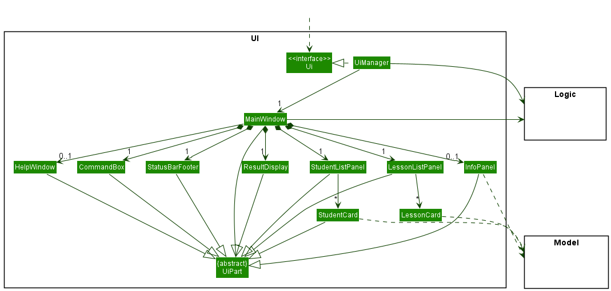
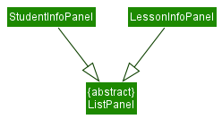
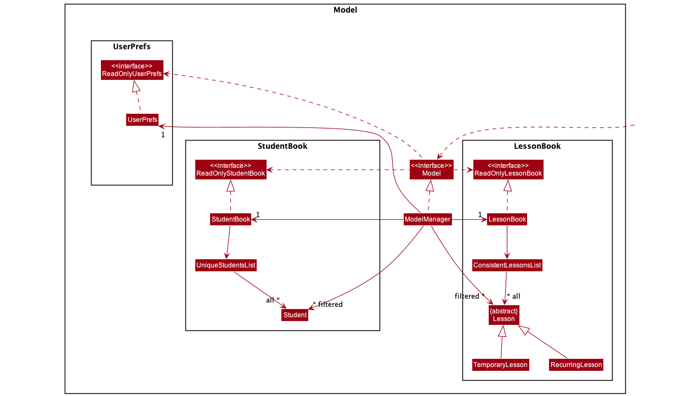
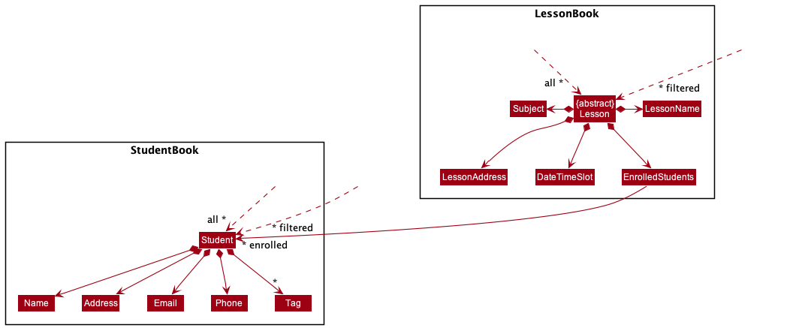
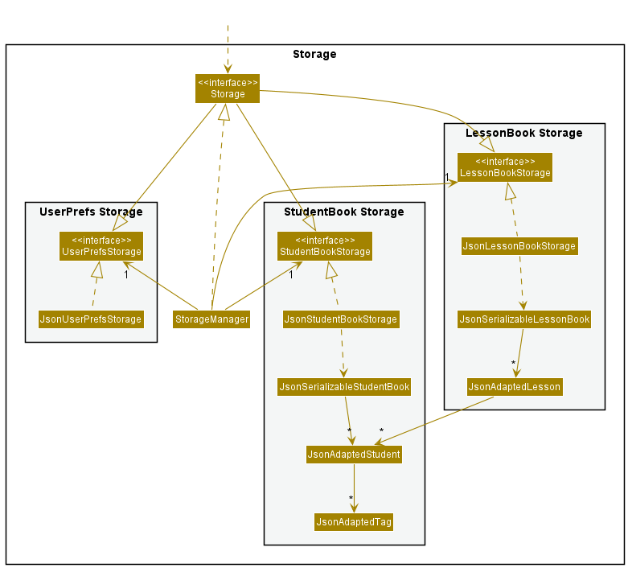
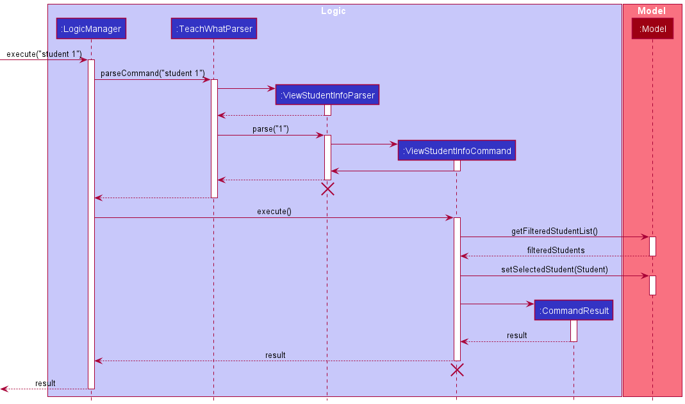
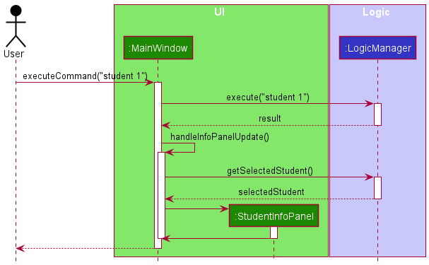
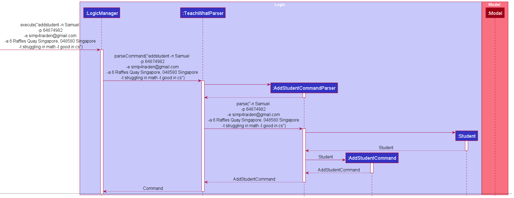
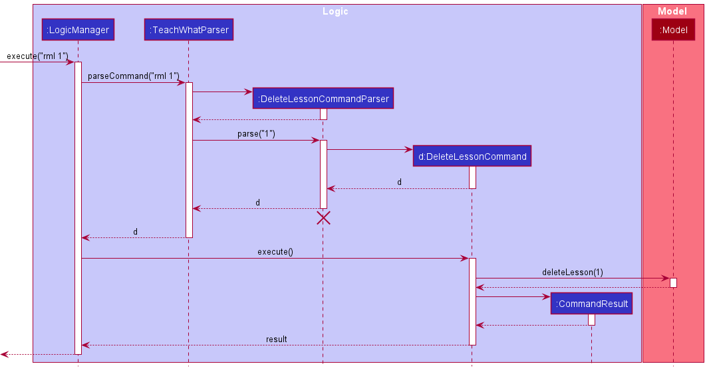
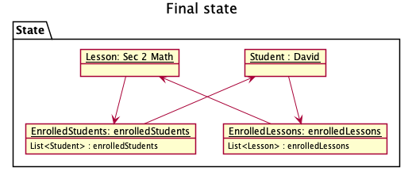

## Table of Contents
* [**Introduction**](#introduction)
* [**Acknowledgements**](#acknowledgements)
* [**Setting up, getting started**](#setting-up-getting-started)
* [**Design**](#design)
  * [Architecture](#architecture)
  * [UI component](#ui-component)
  * [Logic component](#logic-component)
  * [Model component](#model-component)
  * [Storage component](#storage-component)
  * [Common classes](#common-classes)
* [**Implementation**](#implementation)
  * [Viewing a Lesson or Student's details](#viewing-a-lesson-or-students-details)
    * [Step 1: User input](#step-1-user-inputs-student-1-into-the-commandbox-and-hits-enter)
    * [Step 2: Logic parses input](#step-2-logic-parses-the-users-input-and-returns-the-result)
    * [Step 3: Executing the command](#step-3-executing-the-command)
    * [Step 4: Updating the UI](#step-4-updating-the-ui)
  * [Add student](#add-student)
  * [Add temporary/recurring lesson](#add-temporaryrecurring-lesson)
    * [Determining if a lesson clashes with any existing lessons](#determining-if-a-lesson-clashes-with-any-existing-lessons)
  * [Assign student to lesson](#assign-student-to-lesson)
    * [Step 1: User launches application and executes command](#step-1-the-user-launches-the-application-and-executes-the-following)
    * [Step 2: User executes commands to find IDs](#step-2-the-user-executes-the-following-to-find-the-respective-ids-of-the-student-and-lesson)
    * [Step 3: User executes assign command](#step-3-the-user-executes-the-command-assign--s-1--l-1-the-command-does-the-following)
* [**Documentation, logging, testing, configuration, dev-ops**](#documentation-logging-testing-configuration-dev-ops)
* [**Appendix: Requirements**](#appendix-requirements)
  * [Product scope](#product-scope)
  * [User stories](#user-stories)
  * [Use cases](#use-cases)
    * [Add a temporary lesson](#add-a-temporary-lesson)
    * [Add a recurring lesson](#add-a-recurring-lesson)
    * [Delete a lesson](#delete-a-lesson)
    * [Assign a student to a class](#assign-a-student-to-a-lesson)
    * [Delete a student](#delete-a-student)
  * [Non-Functional Requirements](#non-functional-requirements)
  * [Glossary](#glossary)
* [**Appendix: Instructions for manual testing**](#appendix-instructions-for-manual-testing)
  * [First launch and saving window preferences](#first-launch-and-saving-window-preferences)
  * [Adding a lesson / Viewing a lesson's details](#adding-a-lesson--viewing-a-lessons-details)
  * [Adding a student / Viewing a student's details](#adding-a-student--viewing-a-students-details)
  * [Deleting a student](#deleting-a-student)
  * [Saving data](#saving-data)

## **Introduction**

TeachWhat! is a desktop application that helps private Tutors manage their students and classes.

--------------------------------------------------------------------------------------------------------------------

## **Acknowledgements**

- TeachWhat! is adapted from [AddressBook Level-3 (AB3)](https://se-education.org/addressbook-level3/)
- Libraries used: JavaFX, Jackson, JUnit5

--------------------------------------------------------------------------------------------------------------------

## **Setting up, getting started**

Refer to the [set-up guide.](https://github.com/AY2122S2-CS2103T-W11-3/tp/blob/master/docs/SettingUp.md)

--------------------------------------------------------------------------------------------------------------------

## **Design**

<div markdown="span" class="alert alert-primary">

:bulb: **Tip:** The `.puml` files used to create diagrams in this document can be found in the [diagrams](https://github.com/AY2122S2-CS2103T-W11-3/tp/tree/master/docs/diagrams) folder.
</div>

[return to top ↑](#table-of-contents)

### Architecture


The ***Architecture Diagram*** given above explains the high-level design of the App.

Given below is a quick overview of main components and how they interact with each other.

**Main components of the architecture**

**`Main`** has two classes called [`Main`](https://github.com/AY2122S2-CS2103T-W11-3/tp/blob/master/src/main/java/seedu/address/Main.java) and [`MainApp`](https://github.com/AY2122S2-CS2103T-W11-3/tp/blob/master/src/main/java/seedu/address/MainApp.java). It is responsible for,
* At app launch: Initializes the components in the correct sequence, and connects them up with each other.
* At shut down: Shuts down the components and invokes cleanup methods where necessary.

[**`Commons`**](#common-classes) represents a collection of classes used by multiple other components.

The rest of the App consists of four components.

* [**`UI`**](#ui-component): The UI of the App.
* [**`Logic`**](#logic-component): The command executor.
* [**`Model`**](#model-component): Holds the data of the App in memory.
* [**`Storage`**](#storage-component): Reads data from, and writes data to, the hard disk.


**How the architecture components interact with each other**

The *Sequence Diagram* below shows how the components interact with each other for the scenario where the user issues the command `rms 1`.


Each of the four main components (also shown in the diagram above),

* defines its *API* in an `interface` with the same name as the Component.
* implements its functionality using a concrete `{Component Name}Manager` class (which follows the corresponding API `interface` mentioned in the previous point.

For example, the `Logic` component defines its API in the `Logic.java` interface and implements its functionality using the `LogicManager.java` class which follows the `Logic` interface. Other components interact with a given component through its interface rather than the concrete class (reason: to prevent outside component's being coupled to the implementation of a component), as illustrated in the (partial) class diagram below.


The sections below give more details of each component.

[return to top ↑](#table-of-contents)

### UI component
The **API** of this component is specified in `Ui.java`



The UI consists of a `MainWindow` that is made up of multiple parts eg. `CommandBox`, `ResultDisplay`, 
`StudentListPanel`, `InfoPanel` etc. All these components, including the `MainWindow` inherits from the abstract
`UiPart` class which captures the commonalities between classes that represent parts of the visible GUI.

The `UI` component uses the JavaFx UI framework. The layout of these UI parts are defined in matching `.fxml` files 
that are in the `src/main/resources/view` folder. For example, the layout of the 
[`MainWindow`](https://github.com/AY2122S2-CS2103T-W11-3/tp/blob/master/src/main/java/seedu/address/ui/MainWindow.java) is specified in 
[`MainWindow.fxml`](../src/main/resources/view/MainWindow.fxml).

The `UI` component,
- executes user commands using the `Logic` component.
- listens for changes to `Model` data so that the UI can be updated with the modified data.
- keeps a reference to the `Logic` component, because the `UI` relies on the `Logic` component to execute commands.
- depends on some classes in the `Model` component, as it displays `Person` object residing in the `Model`.


The bottom half of the `UI` component is split into two parts using a `SplitPane` component from 
the JavaFX UI framework. 

The left pane contains a `TabPane` that contains two tabs which hold a 
[`LessonListPanel`](https://github.com/AY2122S2-CS2103T-W11-3/tp/blob/master/src/main/java/seedu/address/ui/listpanel/LessonListPanel.java) and a
[`StudentListPanel`](https://github.com/AY2122S2-CS2103T-W11-3/tp/blob/master/src/main/java/seedu/address/ui/listpanel/StudentListPanel.java).
The **_Lessons_** tab contains a 
[`LessonListPanel`](https://github.com/AY2122S2-CS2103T-W11-3/tp/blob/master/src/main/java/seedu/address/ui/listpanel/LessonListPanel.java) which lists out `Lesson` entries 
while the **_Students_** tab contains a 
[`StudentListPanel`](https://github.com/AY2122S2-CS2103T-W11-3/tp/blob/master/src/main/java/seedu/address/ui/listpanel/StudentListPanel.java) which lists out `Student`
entries.

To switch between the tabs, the methods `MainWindow#toggleLessonTab()` and `MainWindow#toggleStudentTab()` can be used 
to switch between the **_Lesson_** tab and **_Student_** tab respectively. Switching the tabs by using user commands is 
done by the method `MainWindow#toggleTab()`.



The right pane contains an [`InfoPanel`](https://github.com/AY2122S2-CS2103T-W11-3/tp/blob/master/src/main/java/seedu/address/ui/infopanel/InfoPanel.java) 
component can either show the details of a `Lesson` entry or `Student` entry. A
[`LessonInfoPanel`](https://github.com/AY2122S2-CS2103T-W11-3/tp/blob/master/src/main/java/seedu/address/ui/infopanel/LessonInfoPanel.java) is used to show the details of a 
`Lesson` entry, while a [`StudentInfoPanel`](https://github.com/AY2122S2-CS2103T-W11-3/tp/blob/master/src/main/java/seedu/address/ui/infopanel/StudentInfoPanel.java) is used
to show the details of a `Student` entry.

The methods `MainWindow#populateInfoPanelWithLesson()` and `MainWindow#populateInfoPanelWithStudent()` can be used to
populate the `InfoPanel` with the provided entry. Populating the `InfoPanel` using user commands is handled by the 
method `MainWindow#handleInfoPanelUpdate()`.

Refer to [Viewing a Lesson or Student's details](#viewing-a-lesson-or-students-details) implementation.

[return to top ↑](#table-of-contents)

### Logic component

**API** : [`Logic.java`](https://github.com/AY2122S2-CS2103T-W11-3/tp/blob/master/src/main/java/seedu/address/logic/Logic.java)

Here's a (partial) class diagram of the `Logic` component:


How the `Logic` component works:
1. When `Logic` is called upon to execute a command, it uses the `TeachWhatParser` class to parse the user command.
2. This results in a `Command` object (more precisely, an object of one of its subclasses e.g., `DeleteStudentCommand`) which is executed by the `LogicManager`.
3. The command can communicate with the `Model` when it is executed (e.g. to delete a student).
4. The result of the command execution is encapsulated as a `CommandResult` object which is returned back from `Logic`.

The Sequence Diagram below illustrates the interactions within the `Logic` component for the `execute("rms 1")` API call.


<div markdown="span" class="alert alert-info">:information_source: **Note:** The lifeline for `DeleteStudentCommandParser` should end at the destroy marker (X) but due to a limitation of PlantUML, the lifeline reaches the end of diagram.
</div>

Here are the other classes in `Logic` (omitted from the class diagram above) that are used for parsing a user command:


How the parsing works:
* When called upon to parse a user command, the `TeachWhatParser` class creates an `XYZCommandParser` (`XYZ` is a placeholder for the specific command name e.g., `DeleteStudentCommandParser`) which uses the other classes shown above to parse the user command and create a `XYZCommand` object (e.g., `DeleteStudentCommand`) which the `TeachWhatParser` returns back as a `Command` object.
* All `XYZCommandParser` classes (e.g., `AddStudentCommandParser`, `DeleteStudentCommandParser`, ...) inherit from the `Parser` interface so that they can be treated similarly where possible e.g, during testing.

[return to top ↑](#table-of-contents)

### Model component
**API** : [`Model.java`](https://github.com/AY2122S2-CS2103T-W11-3/tp/blob/master/src/main/java/seedu/address/model/Model.java)



The `ModelManager` component,
* stores the student book data i.e., all `Student` objects (which are contained in a `UniquePersonList` object).
* stores the lesson book data i.e., all `Lesson` objects (which are contained in a `ConsistentLessonList` object).
* stores a `UserPref` object that represents the user’s preferences.

the `ModelManager` component also,
* stores the currently 'selected' `Student` objects (e.g., results of a search query) as a separate _filtered_ list which is exposed to outsiders as an unmodifiable `ObservableList<Student>` that can be 'observed' e.g. the UI can be bound to this list so that the UI automatically updates when the data in the list change.
* similarly, it stores the currently 'selected' `Lesson` objects (e.g., results of a search query) as a separate _filtered_ list which is exposed to outsiders as an unmodifiable `ObservableList<Lesson>` that can be 'observed' e.g. the UI can be bound to this list so that the UI automatically updates when the data in the list change.

Each `Lesson` has an association with a list of `EnrolledStudents`, which contains references to each `Student` assigned to the lesson.



[return to top ↑](#table-of-contents)

### Storage component

**API** : [`StorageManager.java`](https://github.com/AY2122S2-CS2103T-W11-3/tp/blob/master/src/main/java/seedu/address/storage/StorageManager.java)



The `Storage` component
* saves lesson book data, student book data and user preference data in json format, and read them back into the 
corresponding objects.
* inherits from `LessonBookStorage`, `StudentBookStorage` and `UserPrefStorage`, which means it can be treated as any 
one of the three (if only the functionality of one is needed).
* depends on some classes in the `Model` component because its job is to save/retrieve objects that belong to the `Model`.

[return to top ↑](#table-of-contents)

### Common classes

Classes used by multiple components are in the `seedu.address.commons` package.

[return to top ↑](#table-of-contents)

--------------------------------------------------------------------------------------------------------------------

## **Implementation**

This section describes some noteworthy details on how certain features are implemented.

### Viewing a Lesson or Student's details

Viewing details of a `Lesson` or `Student` on the `InfoPanel` component in the `UI` is done through the `lesson` or 
`student` command.

When the command is entered, the 
[`TeachWhatParser`](https://github.com/AY2122S2-CS2103T-W11-3/tp/blob/master/src/main/java/seedu/address/logic/parser/TeachWhatParser.java)
would **parse** the given user input and return either a 
[`ViewLessonInfoCommand`](https://github.com/AY2122S2-CS2103T-W11-3/tp/blob/master/src/main/java/seedu/address/logic/commands/ViewLessonInfoCommand.java)
or [`ViewStudentInfoCommand`](https://github.com/AY2122S2-CS2103T-W11-3/tp/blob/master/src/main/java/seedu/address/logic/commands/ViewStudentInfoCommand.java) 
object, depending on which command was used. 

When the Command is executed by `Logic`, the executed command would make some attribute changes to `Model` (which holds
the data of the App in memory) and also update the `InfoPanel` component of the `UI` with detailed information of the 
selected `Lesson` or `Student`. A more detailed explanation is shown below.

Given below is an example where a user inputs `student 1` as a command to view the details of the first student on the 
list.

#### Step 1: User inputs `student 1` into the `CommandBox` and hits enter.

[`MainWindow`](https://github.com/AY2122S2-CS2103T-W11-3/tp/blob/master/src/main/java/seedu/address/ui/MainWindow.java)
receives the user input through the `MainWindow#executeCommand()` method. 
[`MainWindow`](https://github.com/AY2122S2-CS2103T-W11-3/tp/blob/master/src/main/java/seedu/address/ui/MainWindow.java)
then sends the user input to `Logic` and retrieves the result.

#### Step 2: `Logic` parses the user's input and returns the result



`Logic` parses the user's input through multiple `Parser` classes as shown in the sequence diagram above. User
input is first sent to the [`TeachWhatParser`](https://github.com/AY2122S2-CS2103T-W11-3/tp/blob/master/src/main/java/seedu/address/logic/parser/TeachWhatParser.java)
where it looks for the main command `student`. It passes the arguments to
the relevant **Command Parser** which in this case is 
[`ViewStudentInfoParser`](https://github.com/AY2122S2-CS2103T-W11-3/tp/blob/master/src/main/java/seedu/address/logic/parser/ViewStudentInfoCommandParser.java).

[`ViewStudentInfoParser`](https://github.com/AY2122S2-CS2103T-W11-3/tp/blob/master/src/main/java/seedu/address/logic/parser/ViewStudentInfoCommandParser.java)
takes in the provided index and creates a 
[`ViewStudentInfoCommand`](https://github.com/AY2122S2-CS2103T-W11-3/tp/blob/master/src/main/java/seedu/address/logic/commands/ViewStudentInfoCommand.java).
This `Command` is returned back to `LogicManager` where it is executed with the `ViewStudentInfoCommand#execute()` method.

#### Step 3: Executing the command

As shown in the diagram above, when `ViewStudentInfoCommand#execute()` is called,
[`ViewStudentInfoCommand`](https://github.com/AY2122S2-CS2103T-W11-3/tp/blob/master/src/main/java/seedu/address/logic/commands/ViewStudentInfoCommand.java)
retrieves the filtered list (the current list shown in the UI) from `Model` and picks out the selected student based on
the index provided by the user's input. It then sets `ModelManager#selectedStudent` using the 
`ModelManager#setSelectedStudent()` method, which will be used by
[`MainWindow`](https://github.com/AY2122S2-CS2103T-W11-3/tp/blob/master/src/main/java/seedu/address/ui/MainWindow.java)
later on.

[`ViewStudentInfoCommand`](https://github.com/AY2122S2-CS2103T-W11-3/tp/blob/master/src/main/java/seedu/address/logic/commands/ViewStudentInfoCommand.java)
creates a 
[`CommandResult`](https://github.com/AY2122S2-CS2103T-W11-3/tp/blob/master/src/main/java/seedu/address/logic/commands/CommandResult.java)
object, with the parameter `infoPanelType = InfoPanelTypes.STUDENT`. 
[`InfoPanelTypes`](https://github.com/AY2122S2-CS2103T-W11-3/tp/blob/master/src/main/java/seedu/address/logic/commands/misc/InfoPanelTypes.java)
is an enumerator representing the different states of the InfoPanel. This is then returned to `LogicManager` which
returns it back to `MainWindow`.

#### Step 4: Updating the UI



Once 
[`MainWindow`](https://github.com/AY2122S2-CS2103T-W11-3/tp/blob/master/src/main/java/seedu/address/ui/MainWindow.java) 
receives the 
[`CommandResult`](https://github.com/AY2122S2-CS2103T-W11-3/tp/blob/master/src/main/java/seedu/address/logic/commands/CommandResult.java)
object, it checks for the `CommandResult#updateInfoPanel` boolean. If the
boolean is true, it runs the `MainWindow#handleInfoPanelUpdate()` method which updates the `InfoPanel`. It does this by
retrieving the selected student from `ModelManager#selectedStudent` and creates a new
[`StudentInfoPanel`](https://github.com/AY2122S2-CS2103T-W11-3/tp/blob/master/src/main/java/seedu/address/ui/infopanel/StudentInfoPanel.java)
with the selected student and its details. The newly created
[`StudentInfoPanel`](https://github.com/AY2122S2-CS2103T-W11-3/tp/blob/master/src/main/java/seedu/address/ui/infopanel/StudentInfoPanel.java)
is shown on the right side of the application.

The execution of the command is complete and the result is shown in the image below, where the right side of the
application is updated with the details of the selected `Student`.


A similar process is done when using the `lesson` command but with its corresponding `Parser` and `Command` objects.

[return to top ↑](#table-of-contents)

### Add student
Adding a new `Student` to TeachWhat! is done through the `LogicManager`. The user input is parsed by the 
`TeachWhatParser` into a `Command` which is executed by `LogicManager#execute()`.

Given below is an example scenario:

Step 1. The user requests to add a student that has the following details,
- `name`: Samuel
- `phone number`: 64874982
- `email`: simp4raiden@gmail.com
- `address`: 6 Raffles Quay Singapore, 048580 Singapore
- `tag`: struggling in math, good in cs

Step 2. The user enters the command

``addstudent -n Samuel -p 64874982 -e simp4raiden@gmail.com -a 6 Raffles Quay Singapore, 048580 Singapore -t struggling in math -t good in cs``

Step 3. The user input is passed into `LogicManager#execute(commandText)`.

Step 4. `LogicManager` uses the `TeachWhatParser#parseCommand(userInput)` to parse the user input.

Step 5. The `TeachWhatParser` detects the command word `addstudent` and passes the student details to `AddStudentCommandParser#parse(args)`.

Step 6. The `AddStudentCommandParser` uses `ArgumentMultimap` to map the student details into the prefixes `name`, `phone`, `email`, `address` and `tag`, and constructs a new `Student` and passes the `Student` to
`AddStudentCommand` which it then returns.

* Constraints
    * Multiple `tag` prefixes can be given but only one `name`, `phone`, `email` and `address` can be given.
    * All the prefixes are optional except for `name` and `phone`

      `ParseException` will be thrown if the constraints are violated

Step 7. The `LogicManager` then executes the `AddStudentCommand` and the `Student` is added to the `Student Book` if another `Student` with the same name does not already exist.

The following sequence diagram shows how the add student command works.



[return to top ↑](#table-of-contents)

### Delete student or lesson
Deleting a `Student` or `Lesson` to TeachWhat! is done through the `LogicManager`. The user input is parsed by the
`TeachWhatParser` into a `Command` which is executed by `LogicManager#execute()`.

Given below is an example scenario:

Step 1. The user requests to delete student that is of index 1 on the viewable student list,

Step 2. The user enters the command `rml 1`

Step 3. The user input is passed into `LogicManager#execute(commandText)`.

Step 4. `LogicManager` uses the `TeachWhatParser#parseCommand(userInput)` to parse the user input.

Step 5. The `TeachWhatParser` detects the command word `rml` and passes the student details to `DeleteLessonCommandParser#parse(args)`.

Step 6. The `DeleteLessonCommandParser` uses `ParserUtil#parseIndex(oneBasedIndex)` to parse the one-based index of the lesson to be deleted into a zero-based `Index`. This is used to construct a new
`DeleteLessonCommand` which it then returns.

* Constraints
   * `ParserUtil#parseIndex(oneBasedIndex)` rejects non-positive integers (i <= 0)
   * `ParserUtil#parseIndex(oneBasedIndex)` rejects values that are not of type `java.lang.Integer`
     `ParseException` will be thrown if the constraints are violated

Step 7. The `LogicManager` then executes the `DeleteLessonCommand` and the `Lesson` is removed from the `Lesson Book`.

* Constraint
  * The `Index` in `DeleteStudentCommand` must not be greater than or equal to the size of the viewable student list.
    `ParseException` will be thrown if the constraints are violated



### Add temporary/recurring lesson
Adding a new `Lesson` to TeachWhat! follows a process that is similar to adding a new `Student`, with the following key differences,
- the `TeachWhatParser` detects the command word `addlesson` and passes the lessons details to `AddLessonCommandParser#parse`
- the `AddLessonCommandParser` then maps the arguments into the prefixes `name`, `subject`, `address`, `date`, `startTime` and `recurring`
- after which it constructs a new `Lesson` and passes it to the `AddLessonComand` 

The following sequence diagram shows how the add lesson operation works when a user enters the following command:
`addlesson
-n Sec 2 Biology Lesson
-s Biology -a Blk 11 Ang Mo Kio Street 74, #11-04
-d 17-04-2022 -t 18:00 -h 1`


The following sequence diagram shows,
- how an `AddLessonCommand` is instantiated from the given user input
- how a new instance of a `TemporaryLesson` or `RecurringLesson` is instantiated from the arguments given by the user


The following sequence diagram shows how `AddLessonCommand`
- sets the newly added lesson as the selected lesson in the UI through `Model`


The following sequence diagram shows how `AddLessonCommand`
- updates the UI to show a list of conflicting lessons by updating the filtered lesson list through `Model` using an instance of `ConflictingLessonsPredicate`


#### Determining if a lesson clashes with any existing lessons

When a user requests to add a new lesson to the list, it is important to check that the new lesson ***does not clash with any existing lessons in the list.***

This is done by the `ConsistentLessonList` class, which enforces ***consistency*** between existing lessons stored in the list.

A list of lessons is considered ***consistent*** when no lessons clash with each another. In particular, the following two conditions are enforced by the `ConsistentLessonList`:
- no two temporary lessons should have overlapping timeslots (ie: a lesson should ***not*** start when another lesson has not ended)
- no recurring lesson should have overlapping timeslots with any temporary lesson or recurring lesson that falls on the same weekday as it

This is done with the method `ConsistentLessonList#hasConflictingLesson()`, which takes in the `Lesson` to be added and
- goes through the list and compares each *existing* `Lesson` with it
- and returns true if any existing lessons clashes with it

The following sequence diagram shows how this is done:


[return to top ↑](#table-of-contents)

### Assign student to lesson

The feature assigns a `Student` to a `Lesson`. The `AssignCommand` class 
extends the `Command` and overwrites the `Command#execute()` method.

Using the `Model` object passed in as an argument of the `AssignCommand#execute()`
method, the following methods are invoked in the `AssignCommand#execute()` method:
* `Model#updateAssignment()`
    * adds `Student` to the `enrolledStudents` attribute `Lesson`
    * adds `Lesson` to the `enrolledLessons` attribute of the `Student`
* `Model#setSelectedStudent()` - sets the `selectedStudent` attribute of `Model` to
the `Student` that is being assigned. This is done to display the `Student` details
in the `MainWindow#InfoPanel`.


The `AssignCommand#execute()` method returns a `CommandResult` upon a
successful assignment.


Given below is an example usage scenario on how the assign command works.

#### Step 1: The user launches the application and executes the following
* `addlesson -n Sec 2 Math...` which adds a `Lesson` named "Sec 2 Math".
* `addstudent -n David...` which adds a `Student` named "David".


#### Step 2: The user executes the following to find the respective IDs of the `Student` and `Lesson`.
* `listlessons` command to see that the `Lesson` named "Sec 2 Math" has a `LESSON_ID` of 1.
* `liststudents` command to see that the `Student` named "David" has a `STUDENT_ID` of 1.

#### Step 3: The user executes the command `assign -s 1 -l 1`. The command does the following:
* adds `Student` "David" to the `enrolledStudents` attribute of the `Lesson` "Sec 2 Math".
* adds `Lesson` "Sec 2 Math" to the `enrolledLessons` attribute of the `Student` "David".



The following sequence diagram shows how the assign operation works.


> **Note**: The lifeline for AssignCommandParser should end at the destroy marker (X) but due to a limitation of 
> PlantUML, the lifeline reaches the end of diagram.

[return to top ↑](#table-of-contents)

--------------------------------------------------------------------------------------------------------------------

## **Documentation, logging, testing, configuration, dev-ops**

* [Documentation guide](Documentation.md)
* [Testing guide](Testing.md)
* [Logging guide](Logging.md)
* [Configuration guide](Configuration.md)
* [DevOps guide](DevOps.md)

--------------------------------------------------------------------------------------------------------------------

## **Appendix: Requirements**

### Product scope

**Target user profile**:
- is a private tutor
- has multiple students and lessons
- can type fast
- skilled at using the command line

**Value proposition**:\
If a tutor has many students, it may be difficult to keep track of all of the students and the rates offered to each of them. TeachWhat! solves this issue by helping tutors manage their schedule, students and income more efficiently.

[return to top ↑](#table-of-contents)

### User stories
Priorities: High (must have) - `* * *`, Medium (nice to have) - `* *`, Low (unlikely to have) - `*`

| Priority | As a …​    | I want to …​                                              | So that I can…​                                              |
|---------|------------|-----------------------------------------------------------|--------------------------------------------------------------|
| `* * *` | user       | add my student's information                              | keep track of their progress                                 |
| `* * *` | user       | delete lessons                                            | clear old lessons                                            |
| `* * *` | user       | delete students and their details                         | reduce clutter of old students and keep their privacy intact |
| `* * *` | user       | add lessons to the list and assign students to the lesson | have an overview of which students are attending the lesson  |
| `* *`   | a new user | clear and reset my entire list of lessons and students    | add actual data after testing the program out                |
| `* *`   | user       | specify the type of lesson when creating one              | know if a lesson is permanent or a temporary lesson          |

[return to top ↑](#table-of-contents)

### Use cases

#### Add a temporary lesson
**System:** TeachWhat!  
**Use case:** UC1 - Add a temporary lesson  
**Actor:** User

**MSS**
1. User adds a temporary lesson with a specified name, subject, address, date, time and duration.
2. TeachWhat! updates the list of lesson.
   Use case ends.

**Extensions**
* 1a. User did not provide any name.
    * 1a1. TeachWhat! shows an error message.  
      Use case resumes at step 1.

* 1b. User did not provide a date or date has invalid format.
    * 1b1. TeachWhat! shows an error message.  
      Use case resumes at step 1.

* 1c. User did not provide a starting time or starting time has invalid format.
    * 1c1. TeachWhat! shows an error message.  
      Use case resumes at step 1.

* 1d. User did not provide the duration of lesson or duration of lesson has invalid format.
    * 1d1. TeachWhat! shows an error message.  
      Use case resumes at step 1.

* 1e. User already has existing lesson(s) overlapping with the specified starting, ending time and date.
    * 1e1. TeachWhat! shows an error message and displays a list of such overlapping lesson(s)\
      Use case resumes at step 1.

#### Add a recurring lesson
**System:** TeachWhat!  
**Use case:** UC2 - Add a recurring lesson  
**Actor:** User

**MSS**
1. User adds a recurring lesson with a specified name, subject, address, date, time and duration.
2. TeachWhat! updates the list of lesson.
   Use case ends.

**Extensions**
* 1a. User did not provide any name.
    * 1a1. TeachWhat! shows an error message.  
      Use case resumes at step 1.

* 1b. User did not provide a date or date has invalid format.
    * 1b1. TeachWhat! shows an error message.  
      Use case resumes at step 1.

* 1c. User did not provide a starting time or starting time has invalid format.
    * 1c1. TeachWhat! shows an error message.  
      Use case resumes at step 1.

* 1d. User did not provide the duration of lesson or duration of lesson has invalid format.
    * 1d1. TeachWhat! shows an error message.  
      Use case resumes at step 1.

* 1e. User already has an existing lesson overlapping with the specified starting, ending time and date.
    * 1e1. TeachWhat! shows an error message and displays a list of such overlapping lesson(s)\
      Use case resumes at step 1.

#### Delete a lesson

**System:** TeachWhat!  
**Use case:** UC3 - Delete a lesson   
**Actor:** User

**MSS**
1. User requests to list lessons
2. TeachWhat! shows a list of lessons
3. User requests to delete a specific lesson in the list
4. TeachWhat! deletes the lesson  
   Use case ends.

**Extensions**
* 2a. The list is empty.  
  Use case ends.

* 3a. The given index is invalid.
    * 3a1. TeachWhat! shows an error message.  
      Use case resumes at step 3.

#### Assign a student to a lesson

**System:** TeachWhat!  
**Use case:** UC4 - Assign a student to a lesson  
**Actor:** User

**MSS**
1. User requests to list students
2. TeachWhat! shows a list of students
3. User requests to list lessons
4. TeachWhat! shows a list of lessons
5. User selects the lesson to assign the student to
6. TeachWhat! assigns the student to the lesson.
   Use case ends.

**Extensions**
* 2a. The list of students is empty.  
  Use case ends.

* 4a. The list of lessons is empty.  
  Use case ends.

* 5a. The given index of student or lesson is invalid.
    * 5a1. TeachWhat! shows an error message.  
      Use case resumes at step 5.

#### Delete a student

**System:** TeachWhat!  
**Use case:** UC5 - Delete a student  
**Actor:** User

**MSS**
1. User requests to list students
2. TeachWhat! shows a list of students
3. User requests to delete a specific student in the list
4. TeachWhat! deletes the student  
   Use case ends.

**Extensions**
* 2a. The list is empty.  
  Use case ends.

* 3a. The given index is invalid.
    * 3a1. TeachWhat! shows an error message.  
      Use case resumes at step 3.

[return to top ↑](#table-of-contents)

### Non-Functional Requirements

1. TeachWhat! able to run on all mainstream OS that has Java 11 or above installed
2. Should be able to hold up to 1000 students and lessons without a noticeable sluggishness in performance for typical
   usage
3. A user with above average typing speed for regular English text (i.e. not code, not system admin commands) should be
   able to accomplish most of the tasks faster using commands than using the mouse
4. A new user should be able to pick up on how to use TeachWhat! within 10 minutes
5. TeachWhat! must boot up within 5 seconds on a device that is under normal load (i.e. not running cpu intensive applications in the background).

### Glossary

* **Mainstream OS**: Windows, Linux, Unix, OS-X
* **Command Line**: A text interface for your computer.

[return to top ↑](#table-of-contents)

--------------------------------------------------------------------------------------------------------------------

## **Appendix: Instructions for manual testing**

Given below are instructions to test the app manually.

<div markdown="span" class="alert alert-info">:information_source: **Note:** These instructions only provide a starting point for testers to work on;
testers are expected to do more *exploratory* testing.
</div>

### First launch and saving window preferences
When launching TeachWhat! for the first time, it should populate the list with sample data. Furthermore, it should save
window preferences when you close the program.

1. Launching the app
   1. Refer to the [Quick Start](https://ay2122s2-cs2103t-w11-3.github.io/tp/UserGuide.html#quick-start) section of the
   User Guide on setting up TeachWhat!.
   2. Launch the program using the Terminal with this command `java -jar TeachWhat.jar`
   3. Test Case: First launch\
   Expected: Sample data should populate the lists. A data folder along with config.json and preferences.json should be
   created in the current directory.
2. Saving window preferences
   1. Launch TeachWhat!.
   2. Resize the window to your preference.
   3. Close the program, either by using the `exit` command or closing the window.
   4. Test Case: Restoring window preferences\
   Expected: When relaunching the program, the window position and size should be restored from where you previously
   left off.

### Adding a lesson / Viewing a lesson's details
TeachWhat! allows you to store details of a lesson and view it back later on.

1. Test case 1: Adding a temporary lesson
   1. Condition: No other lesson should have a conflicting timeslot.
   2. Enter the command `addlesson -n Sec 2 Biology Group Tuition -s Biology
      -a Blk 11 Ang Mo Kio Street 74, #11-04
      -d 19-12-2022 -t 18:00 -h 2 -m 15`.
   3. Expected: The lesson should be added to the list, with its details shown on the card.
2. Test case 2: Adding a recurring lesson
   1. Condition: No other lesson should have a conflicting timeslot.
   2. Enter the command `addlesson -r -n Sec 2 Chemistry Group Tuition -s Biology
      -a Blk 11 Ang Mo Kio Street 74, #11-04
      -d 20-12-2022 -t 18:00 -h 2 -m 15`
   3. Expected: The lesson should be added to the list, with its details shown on the card.
3. Test case 3: Adding a conflicting lesson
   1. Condition: Should have another class with a conflicting timeslot.
   2. Enter the command `addlesson -n Sec 2 Mathemathics Group Tuition -s Biology
      -a Blk 11 Ang Mo Kio Street 74, #11-04
      -d 19-12-2022 -t 19:00 -h 2 -m 15`
   3. Expected: In this example, the entered lesson conflicts with the command entered in Test Case 1. TeachWhat! should
   give you a warning that an existing lesson has a conflicting timeslot. The new lesson will not be added to the list.
   The list should also be filtered to show you the conflicting lessons.
4. Test case: Viewing a temporary lesson's details
   1. Condition: An existing temporary lesson should be in the list.
   2. Enter the command `listlessons`.
   3. Assuming an existing temporary lesson has an index of 1, enter the command `lesson 1`.
   4. Expected: The details of that temporary lesson should be shown on the right.
5. Test case: Viewing a recurring lesson's details
   1. Condition: An existing recurring lesson should be in the list.
   2. Enter the command `listlessons`.
   3. Assuming an existing recurring lesson has an index of 2, enter the command `lesson 2`.
   4. Expected: The details of that recurring lesson should be shown on the right. A recurring lesson is denoted by the
   green tag which is labelled `recurring`.

<div markdown="block" class="alert alert-info">
**:information_source: Note that:**<br>
The list of lessons displayed is sorted by the next upcoming lesson date.
</div>

### Adding a student / Viewing a student's details
TeachWhat! allows you to store details of a student and view it back later on.

1. Test case 1: Adding a student
   1. Enter the command `addstudent -n John Doe -p 98765432 -e johnd@example.com -a 311, Clementi Ave 2, #02-25 -t friends -t owesMoney`.
   2. Expected: The student should be added to the list, with its details shown on the card.
2. Test case 2: Viewing a student's details
   1. Condition: An existing student should be in the list.
   2. Assuming an existing student has an index of 1, enter the command `student 1`.
   3. Expected: The details of that student should be shown on the right.

### Deleting a student

This command requires you to have at least one existing student.
* If there are no students, refer to the [`addstudent`](https://github.com/AY2122S2-CS2103T-W11-3/tp/blob/master/docs/UserGuide.md#adding-a-student)
  user guide section to add a student.

1. Testcase 1: Delete `student` of index 1 on the viewable student list.
   1. Execute `liststudents` to ensure that your lists includes all students.
   2. Execute `rmstudent 1` or the shortcut `rms 1`.
   3. Expected: The student of index 1 on the viewable student list is deleted.

2. Testcase 2: Delete `student` with invalid index
    1. Execute `liststudents` to ensure that your lists includes all students.
    2. Execute `rmstudent 0` or the shortcut `rms 0`.
    3. Expected: An invalid index error message is shown.
* Note: An invalid index is any value that is not a positive integer of type `java.lang.Integer`. (e.g. if index is greater than`Integer.MAX_VALUE` or less than 0 or is not of type `java.util.Integer`)

3. Testcase 3: Delete `student` with out-of-bounds index
    1. Execute `liststudents` to ensure that your lists includes all students. (Ensure there are only two students)
    2. Execute `rmstudent 3` or the shortcut `rms 3`.
    3. Expected: An out-of-bounds error message is shown.
* Note: An out-of-bounds index is a positive integer of type `java.lang.Integer` but is a greater than the viewable student list.

### Assigning a student

This command requires you to have at least one existing student and lesson.
* If there are no students, refer to the [`addstudent`](https://github.com/AY2122S2-CS2103T-W11-3/tp/blob/master/docs/UserGuide.md#adding-a-student)
user guide section to add a student.
* If there are no lessons, refer to the [`addslesson`](https://github.com/AY2122S2-CS2103T-W11-3/tp/blob/master/docs/UserGuide.md#adding-a-lesson)
  user guide section to add a lesson.

1. Testcase 1: Assigning `student` to `lesson` successfully
   1. Ensure that `student` with `<STUDENT_ID>` **1** is not already assigned to the `lesson` of `<LESSON_ID>` **1**. 
   2. Execute `liststudents` and `listlessons` to ensure that your lists includes all students and lessons.
   3. Execute the command `assign -s 1 -l 1`. This will assign the first `student` in the list to the first
   `lesson` in the list.
   4. Expected: The details of the `lesson` will be displayed on the right info panel, and you should
   see the `student` that you just assigned in the **Students** list of the `lesson`.
    
2. Testcase 2: Assigning `student` to `lesson` unsuccessfully
   1. Following **Testcase 1**, execute `listlessons` and `liststudents` to ensure that your lists includes
   all existing students and lessons.
   2. Execute the command `assign -l 1 -s 1`.
   3. Expected: An error message will be displayed saying that the student is already enrolled in the lesson.

### Unassigning a student

This command requires you to have at least one existing student and lesson.
* If there are no students, refer to the [`addstudent`](https://github.com/AY2122S2-CS2103T-W11-3/tp/blob/master/docs/UserGuide.md#adding-a-student)
  user guide section to add a student.
* If there are no lessons, refer to the [`addslesson`](https://github.com/AY2122S2-CS2103T-W11-3/tp/blob/master/docs/UserGuide.md#adding-a-lesson)
  user guide section to add a lesson.

1. Testcase 1: Unassigning `student` from `lesson` successfully
    1. Ensure that `student` with `<STUDENT_ID>` **1** is already assigned to the `lesson` of `<LESSON_ID>` **1**.
       1. If not, follow the [**Assigning a student: Testcase 1**](#Assigning-a-student) 
    2. Execute `liststudents` and `listlessons` to ensure that your lists includes all students and lessons.
    3. Execute the command `unassign -s 1 -l 1`. This will unassign the first `student` in the list from the first
       `lesson` in the list.
    4. Expected: The details of the `student` will be displayed on the right info panel, and you should
       **not** see the `lesson` that you just unassigned in the **Lessons** list of the `student`.

2. Testcase 2: Unassigning `student` from `lesson` unsuccessfully
    1. Following **Testcase 1**, execute `listlessons` and `liststudents` to ensure that your lists includes
       all existing students and lessons.
    2. Execute the command `unassign -l 1 -s 1`.
    3. Expected: An error message will be displayed saying that the student is **not** enrolled in the lesson.
    
### Saving data

#### Missing data files
When using TeachWhat! (or any program), there is always a possibility that data-files would go missing. This could either be due to errors caused by the operating-system, or by the user deleting the data-files.

To simulate this scenario, follow the steps below:

1. Create an **empty folder**, and place the `TeachWhat!.jar` inside it.
2. Start the program by following the quick-start instructions in the [User Guide](https://ay2122s2-cs2103t-w11-3.github.io/tp/UserGuide.html#quick-start).
3. Exit the program by entering the `exit` command in the command-box.
   - At this point, you should see that some new files and folders have been created in the folder.
4. Open the folder named **"data"**, and delete both **"lessonbook.json"** and **"studentbook.json"**
    - At this point, the "data" folder would be empty.
5. Start the program again.
   - You should see that the program would start with the default sample list of lessons and students.

As seen in the steps above, the expected-behaviour for missing data-files is that TeachWhat! would simply create another new data-file pre-populated with sample data (as if the user is using the program for the first time.)

#### Corrupted data-files
When using TeachWhat! (or any program), there is always a possibility that data-files would become corrupted. This could either be due to errors caused by the operating-system, or by the user manually-editing the data-files.

To simulate this scenario, follow the steps below:

1. Create an **empty folder**, and place the `TeachWhat!.jar` inside it.
2. Start the program by following the quick-start instructions in the [User Guide](https://ay2122s2-cs2103t-w11-3.github.io/tp/UserGuide.html#quick-start).
3. Exit the program by entering the `exit` command in the command-box.
    - At this point, you should see that some new files and folders have been created in the folder.
4. Open the folder named **"data"**, and open the data-file named **"lessonbook.json"** using a text-editor of your choice.
5. To simulate the file becoming corrupted, you may remove or add some items into the JSON file.
   - In this case, we can simply remove the opening square-bracket from the JSON file, rendering it unreadable, like so:

##### BEFORE
```
{
  "lessons" : [ {                                   // <---------- to remove [
    "lessonName" : "Make up lesson for George",
    "subject" : "Geography",
    "dateTimeSlot" : {
      "dateOfLesson" : "5-1-2022",
      "durationHours" : "2",
      "durationMinutes" : "0",
      "startTime" : "17:50"
    },
    "isRecurring" : false,
    "assignedStudents" : [ ],
    "lessonAddress" : "Blk 47 Tampines Street 20, #17-35"
  }
  
  // ......
}
```

##### AFTER
```
{
  "lessons" : {                                   // <---------- removed [
    "lessonName" : "Make up lesson for George",
    "subject" : "Geography",
    "dateTimeSlot" : {
      "dateOfLesson" : "5-1-2022",
      "durationHours" : "2",
      "durationMinutes" : "0",
      "startTime" : "17:50"
    },
    "isRecurring" : false,
    "assignedStudents" : [ ],
    "lessonAddress" : "Blk 47 Tampines Street 20, #17-35"
  }
  
  // ......
}
```

6. Start the program again.
    - You should see that the program would start with an **EMPTY** list of lessons and students.

As seen in the steps above, the expected-behaviour for corrupted data-files is that TeachWhat! would simply **overwrite both** "lessonbook.json" and "studentbook.json" with an *empty* list.

[return to top ↑](#table-of-contents)
